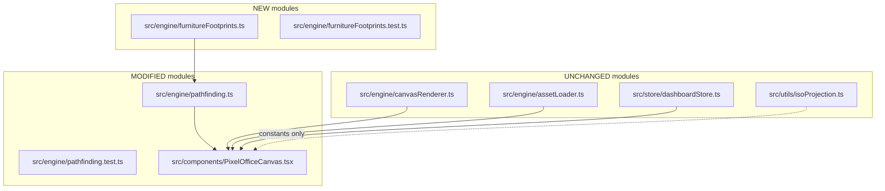
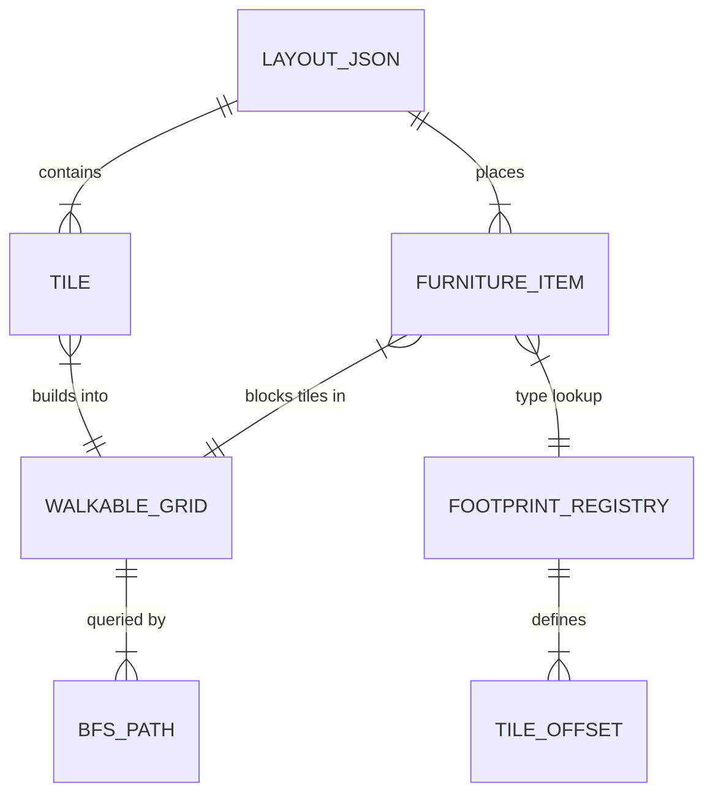
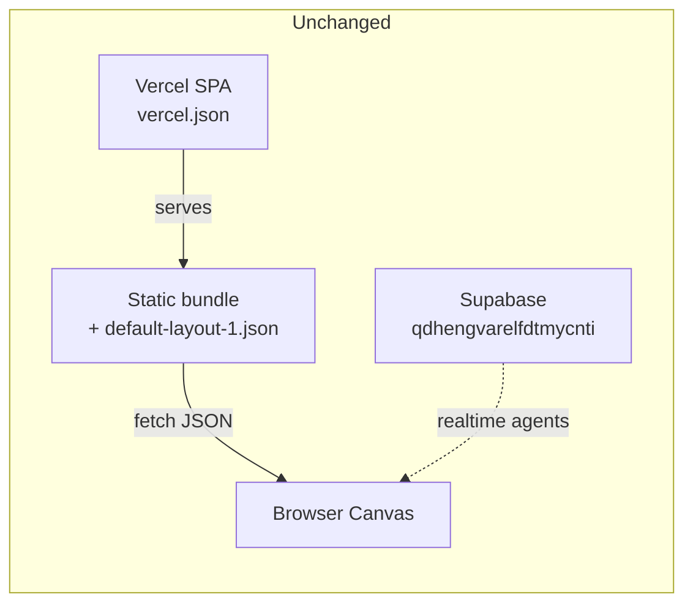
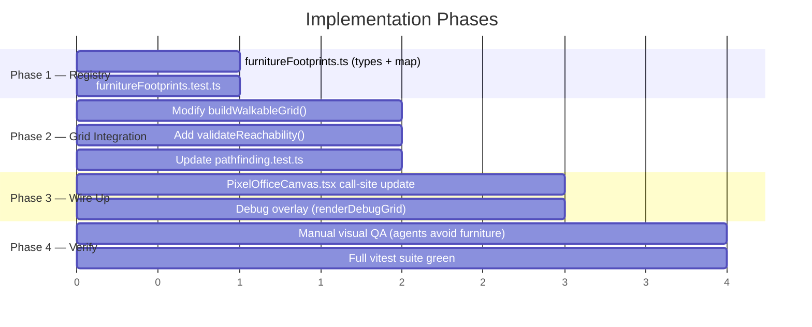

# Architecture

> Directive: "Add obstacle avoidance to agent movement in the isometric office. Agents should pathfind around desks, sofas, and other furniture objects instead of walking through them. Update the pathfinding engine and the office floor plan to mark furniture tiles as non-walkable."
> Size: medium | Cost: $2.9547

Now I have a complete picture of the codebase. Let me produce the solution architecture.

---

# 🏗️ Solution Architecture: Obstacle Avoidance for Agent Pathfinding

## Executive Summary

Agents in the pixel-art office currently walk **straight through furniture** because `buildWalkableGrid()` (`pathfinding.ts:6-21`) only considers tile types (`0`=wall, `255`=void) — it has no knowledge of the ~50 furniture objects placed on the grid. The fix is surgical: create a **furniture footprint registry**, overlay those footprints onto the walkable grid at build time, and add a **reachability safety check** to ensure no agent destinations become trapped.

**Zero new dependencies.** Pure frontend change. No API, no database, no deployment changes.

---

## 1. System Design — Component Architecture

### 1.1 Current Data Flow (Broken)

```mermaid
graph LR
    A["default-layout-1.json"] -->|tiles[]| B["buildWalkableGrid()"]
    A -->|furniture[]| C["renderFurniture()"]
    B -->|WalkableGrid| D["bfsPath()"]
    D -->|path[]| E["PixelOfficeCanvas game loop"]
    C -->|draw sprites| E

    style B fill:#ff4444,stroke:#aa0000,color:#fff
    linkStyle 0 stroke:#ff4444
```

**The bug:** `furniture[]` feeds the renderer but **never** feeds the walkable grid. Two parallel pipelines that don't talk to each other.

### 1.2 Target Data Flow (Fixed)

```mermaid
graph LR
    A["default-layout-1.json"] -->|tiles[]| B["buildWalkableGrid()"]
    A -->|furniture[]| F["furnitureFootprints.ts"]
    F -->|blocked tile coords| B
    B -->|WalkableGrid| V["validateReachability()"]
    V -->|validated grid| D["bfsPath()"]
    D -->|path[]| E["PixelOfficeCanvas game loop"]
    A -->|furniture[]| C["renderFurniture()"]
    C -->|draw sprites| E

    style F fill:#00cc66,stroke:#008844,color:#fff
    style V fill:#00cc66,stroke:#008844,color:#fff
```

### 1.3 Module Dependency Diagram



### 1.4 Files Changed

| File | Action | Reason |
|------|--------|--------|
| `src/engine/furnitureFootprints.ts` | **CREATE** | Furniture type → blocked tile offsets registry |
| `src/engine/furnitureFootprints.test.ts` | **CREATE** | TDD for footprint lookups |
| `src/engine/pathfinding.ts` | **MODIFY** | New `buildWalkableGrid` signature accepts `FurnitureItem[]`; add `validateReachability()` |
| `src/engine/pathfinding.test.ts` | **MODIFY** | Tests for furniture blocking + reachability |
| `src/components/PixelOfficeCanvas.tsx` | **MODIFY** | Pass `furniture[]` to `buildWalkableGrid` (line ~114); add reachability warning |

---

## 2. Data Model — Furniture Footprint Registry

### 2.1 Core Type: `FurnitureFootprint`

```typescript
// src/engine/furnitureFootprints.ts

/**
 * Offset from the furniture item's anchor (col, row) that this piece occupies.
 * A 1×1 item has a single offset [0,0].
 * A 2×1 desk has offsets [[0,0], [1,0]].
 */
export type TileOffset = [colOffset: number, rowOffset: number];

export interface FurnitureFootprint {
  /** Tile offsets relative to the item's anchor (col, row) that are blocked */
  blockedTiles: TileOffset[];
  /** 
   * If true, the anchor tile itself is walkable (e.g., a wall-mounted clock).
   * Default: false (anchor is blocked).
   */
  anchorWalkable?: boolean;
}
```

### 2.2 Registry Map — All ~20 Furniture Types

Derived from actual asset dimensions in `assetLoader.ts:34-56` and placement data in `default-layout-1.json:53-102`:

```typescript
export const FURNITURE_FOOTPRINTS: Record<string, FurnitureFootprint> = {
  // ── Desks (2 tiles wide × 1 tall) ──────────────────────────
  DESK_FRONT:   { blockedTiles: [[0,0], [1,0]] },
  DESK_SIDE:    { blockedTiles: [[0,0], [0,1]] },

  // ── PCs (1×1, sit on top of desks — already blocked by desk) ─
  PC_FRONT_OFF: { blockedTiles: [[0,0]] },
  PC_FRONT_ON_1:{ blockedTiles: [[0,0]] },
  PC_FRONT_ON_2:{ blockedTiles: [[0,0]] },
  PC_FRONT_ON_3:{ blockedTiles: [[0,0]] },
  PC_BACK:      { blockedTiles: [[0,0]] },
  PC_SIDE:      { blockedTiles: [[0,0]] },

  // ── Sofas (3 tiles wide) ────────────────────────────────────
  SOFA_FRONT:   { blockedTiles: [[0,0], [1,0], [2,0]] },
  SOFA_BACK:    { blockedTiles: [[0,0], [1,0], [2,0]] },
  SOFA_SIDE:    { blockedTiles: [[0,0], [0,1], [0,2]] },

  // ── Chairs (1×1) ────────────────────────────────────────────
  CUSHIONED_CHAIR_FRONT: { blockedTiles: [] },  // walkable! agents sit here
  CUSHIONED_CHAIR_BACK:  { blockedTiles: [] },
  CUSHIONED_CHAIR_SIDE:  { blockedTiles: [] },
  WOODEN_CHAIR_SIDE:     { blockedTiles: [] },

  // ── Tables ──────────────────────────────────────────────────
  COFFEE_TABLE:       { blockedTiles: [[0,0], [1,0]] },
  SMALL_TABLE_FRONT:  { blockedTiles: [[0,0]] },

  // ── Decorative (1×1 blocking) ───────────────────────────────
  LARGE_PLANT:  { blockedTiles: [[0,0]] },
  PLANT:        { blockedTiles: [[0,0]] },
  PLANT_2:      { blockedTiles: [[0,0]] },
  BIN:          { blockedTiles: [[0,0]] },
  COFFEE:       { blockedTiles: [[0,0]] },

  // ── Bookshelves (2 tiles wide, wall-mounted — row 0 already wall) ─
  BOOKSHELF:        { blockedTiles: [[0,0]] },
  DOUBLE_BOOKSHELF: { blockedTiles: [[0,0], [1,0], [2,0]] },

  // ── Wall art (mounted on walls — no floor blocking) ─────────
  WHITEBOARD:       { blockedTiles: [], anchorWalkable: true },
  CLOCK:            { blockedTiles: [], anchorWalkable: true },
  LARGE_PAINTING:   { blockedTiles: [], anchorWalkable: true },
  SMALL_PAINTING:   { blockedTiles: [], anchorWalkable: true },
  SMALL_PAINTING_2: { blockedTiles: [], anchorWalkable: true },
};
```

### 2.3 Design Decisions

| Decision | Rationale |
|----------|-----------|
| **Chairs are walkable** (`blockedTiles: []`) | Agents need to reach chair positions — these are seat destinations per `ROLE_SEATS` in `PixelOfficeCanvas.tsx:33-40` |
| **Wall art has `anchorWalkable: true`** | Mounted on row 0 (already wall tiles) — no floor impact |
| **Registry is TypeScript, not JSON** | Per ADR-002: type safety, no async load, tree-shakeable, easy to extend |
| **`:left` modifier stripped before lookup** | `canvasRenderer.ts:129` already splits on `:` — we follow the same pattern |

### 2.4 Entity Relationship (minimal — purely frontend)



---

## 3. API Design

### 3.1 Public Function Signatures (Internal Module API)

**No HTTP endpoints are involved.** This is a purely client-side computation. The "API" here is the TypeScript module interface.

#### `furnitureFootprints.ts` — NEW

```typescript
/** Look up the footprint for a furniture type, stripping :left/:right modifiers */
export function getFootprint(furnitureType: string): FurnitureFootprint;

/** Compute all absolute (col, row) tile positions blocked by a furniture array */
export function computeBlockedTiles(
  furniture: FurnitureItem[],
  cols: number,
  rows: number
): Set<string>;  // Set of "col,row" keys for O(1) lookup
```

#### `pathfinding.ts` — MODIFIED

```typescript
/** BEFORE — current signature (pathfinding.ts:6) */
export function buildWalkableGrid(
  tiles: number[],
  cols: number,
  rows: number
): WalkableGrid;

/** AFTER — extended signature, backward-compatible */
export function buildWalkableGrid(
  tiles: number[],
  cols: number,
  rows: number,
  furniture?: FurnitureItem[]   // ← NEW optional param
): WalkableGrid;

/** NEW — BFS flood-fill reachability check */
export function validateReachability(
  grid: WalkableGrid,
  requiredPositions: [number, number][]  // all seat/meeting/break/idle coords
): { reachable: boolean; isolated: [number, number][] };
```

### 3.2 Call Site Change (PixelOfficeCanvas.tsx)

```typescript
// BEFORE (line 114):
walkableRef.current = buildWalkableGrid(
  layoutData.tiles, layoutData.cols, layoutData.rows
);

// AFTER:
walkableRef.current = buildWalkableGrid(
  layoutData.tiles, layoutData.cols, layoutData.rows,
  layoutData.furniture || []     // ← pass furniture
);

// NEW — reachability validation (dev-time safety net)
if (import.meta.env.DEV) {
  const allTargets: [number, number][] = [
    ...Object.values(ROLE_SEATS).map(s => [s.col, s.row] as [number, number]),
    ...BREAK_POSITIONS.map(p => [p.col, p.row] as [number, number]),
    ...IDLE_POSITIONS.map(p => [p.col, p.row] as [number, number]),
    [7, 6], // meeting position
  ];
  const result = validateReachability(walkableRef.current, allTargets);
  if (!result.reachable) {
    console.warn('[PixelOffice] Isolated positions detected:', result.isolated);
  }
}
```

---

## 4. Security Architecture

### Verdict: **N/A — No security surface.**

| Concern | Assessment |
|---------|-----------|
| Auth | No change — feature is pure client-side canvas rendering |
| RLS | No Supabase tables touched |
| Input validation | Furniture data comes from static JSON bundled at build time (`public/assets/default-layout-1.json`) — not user-supplied |
| XSS | No DOM manipulation — all rendering is Canvas 2D `drawImage()` calls |
| Supply chain | Zero new npm dependencies |

---

## 5. Deployment Topology

### Verdict: **No infrastructure changes.**



| Aspect | Status |
|--------|--------|
| CI/CD | Existing `tsc -b && vite build` — no change needed |
| Environments | dev (Vite HMR), prod (Vercel) — unchanged |
| Bundle size | +~2KB for `furnitureFootprints.ts` registry — negligible |
| Static assets | `default-layout-1.json` unchanged (footprints are in TS, not JSON) |
| Vercel config | `vercel.json` SPA routing unchanged |

---

## 6. Observability

### 6.1 Dev-Time Observability (Primary)

Since this is a **game loop running at 60fps in a Canvas**, traditional APM/logging doesn't apply. Instead:

| Signal | Implementation | Location |
|--------|----------------|----------|
| **Reachability warnings** | `console.warn` in DEV mode when `validateReachability()` finds isolated positions | `PixelOfficeCanvas.tsx` load effect |
| **Grid build timing** | `console.time('buildWalkableGrid')` in DEV | `pathfinding.ts` |
| **Path failure count** | Counter incremented when `bfsPath()` returns `[]` for a non-same-tile query, logged every 60s | `PixelOfficeCanvas.tsx` syncAgents |
| **Debug overlay** | Optional `?debug=grid` URL param renders blocked tiles as red semi-transparent overlays on canvas | `canvasRenderer.ts` new `renderDebugGrid()` |

### 6.2 Debug Grid Overlay (Recommended Addition)

```typescript
// canvasRenderer.ts — new optional function
export function renderDebugGrid(
  ctx: CanvasRenderingContext2D,
  grid: WalkableGrid,
  cols: number
) {
  for (let r = 0; r < grid.length; r++) {
    for (let c = 0; c < grid[r].length; c++) {
      if (!grid[r][c]) {
        ctx.fillStyle = 'rgba(255, 0, 0, 0.3)';
        ctx.fillRect(c * TILE_SIZE, r * TILE_SIZE, TILE_SIZE, TILE_SIZE);
      }
    }
  }
}
```

### 6.3 Production Monitoring

No new production monitoring needed. The existing game loop already has:
- Agent heartbeat system (`alive/stale/dead`) — `PixelOfficeCanvas.tsx:193-203`
- `requestAnimationFrame` loop with implicit frame-drop detection — `PixelOfficeCanvas.tsx:239-321`
- Empty-path fallback guard — `PixelOfficeCanvas.tsx:214` (`if (newPath.length > 1)`)

---

## 7. Scalability Plan

### Verdict: **No scaling concerns. This is O(V+E) BFS on a 660-tile grid.**

| Metric | Value | Assessment |
|--------|-------|------------|
| Grid size | 30×22 = 660 tiles | BFS completes in **<0.1ms** |
| Grid build frequency | **Once** on layout load (`PixelOfficeCanvas.tsx:114`) | Not per-frame |
| Path computation frequency | Only when agent target changes (status transition) | ~1-5 calls per business tick, not per frame |
| Furniture count | ~50 items | O(n) footprint overlay — trivial |
| Agent count | 6 max currently | 6 BFS calls max per tick — trivial |
| Memory | ~660 booleans (WalkableGrid) + ~100 Set entries (blockedTiles) | <1KB |

### Future-Proofing (if grid grows)

| Scenario | Mitigation |
|----------|-----------|
| Grid scales to 64×64 (4096 tiles) | BFS still <1ms. No change needed. |
| Grid scales to 128×128 (16K tiles) | Consider A* with Manhattan heuristic. Drop-in replacement for `bfsPath()`. |
| Dynamic furniture (drag-and-drop) | Rebuild walkable grid on furniture move. Still <1ms. Add debounce. |
| Pathfinding request queuing | Not needed at current scale. If >50 agents, batch BFS in a Web Worker. |

---

## 8. Implementation Sequence (Build Order)



### Phase 1: `furnitureFootprints.ts` + tests
- Create the registry module with `FURNITURE_FOOTPRINTS` map
- Export `getFootprint()` and `computeBlockedTiles()`
- Write unit tests: known footprint lookups, unknown types default to 1×1, modifier stripping

### Phase 2: Modify `pathfinding.ts` + tests
- Extend `buildWalkableGrid()` with optional `furniture` param
- After base grid is built from tiles, iterate `computeBlockedTiles()` and set those cells to `false`
- Add `validateReachability()` using BFS flood-fill from an arbitrary walkable tile
- Update existing tests; add new tests for furniture blocking and reachability

### Phase 3: Wire into `PixelOfficeCanvas.tsx`
- Pass `layoutData.furniture` to `buildWalkableGrid()` at line 114
- Add DEV-mode reachability validation with console warnings
- Optional: debug grid overlay behind a URL param

### Phase 4: Visual QA + full test suite
- Run `npm test` — all green
- Visual confirmation that agents pathfind around desks, sofas, plants
- Verify no agent gets stuck (empty path fallback still works)

---

## 9. Risk Matrix

| Risk | Likelihood | Impact | Mitigation |
|------|-----------|--------|------------|
| Incorrect footprint sizes → agents still clip through furniture | Medium | Low | Debug overlay visualization; unit tests with actual layout data |
| Overly aggressive blocking → agents trapped, can't reach seats | Medium | High | `validateReachability()` at grid build time; chairs explicitly walkable |
| Performance regression in game loop | Very Low | Medium | Grid builds once; BFS only on target change. Profile with `console.time`. |
| Unknown furniture types in future layouts | Low | Low | `getFootprint()` returns 1×1 default for unknown types + `console.warn` |
| Seat positions (`ROLE_SEATS`) land on blocked tiles | Medium | High | Reachability check explicitly validates all seat/break/idle/meeting coords |

---

## 10. Key Architectural Decisions Summary

| ADR | Decision | Reference |
|-----|----------|-----------|
| **ADR-001** | Keep custom BFS — no pathfinding library | 660-tile grid doesn't justify a dependency. `bfsPath()` is 80 LOC. |
| **ADR-002** | Footprint registry as TypeScript module | Type safety, no async load, co-located with engine code |
| **ADR-003** | Overlay furniture blocking into existing `buildWalkableGrid` | Single point of grid construction. Optional param preserves backward compat with existing tests. |
| **ADR-004** | BFS reachability check at grid build time | Catches layout errors immediately. DEV-only by default to avoid prod cost. |
| **ADR-005** | Chairs are walkable (empty `blockedTiles`) | Agent seat destinations (`ROLE_SEATS`) must remain reachable. Chairs represent *where agents sit*. |

---

## Appendix: Concrete Code Diff Preview

### `pathfinding.ts` — `buildWalkableGrid` modification

```typescript
import { computeBlockedTiles } from './furnitureFootprints';
import type { FurnitureItem } from './canvasRenderer';

export function buildWalkableGrid(
  tiles: number[],
  cols: number,
  rows: number,
  furniture?: FurnitureItem[]    // ← NEW
): WalkableGrid {
  const grid: WalkableGrid = [];
  for (let r = 0; r < rows; r++) {
    const row: boolean[] = [];
    for (let c = 0; c < cols; c++) {
      const t = tiles[r * cols + c];
      row.push(t !== 255 && t !== 0);
    }
    grid.push(row);
  }

  // ── NEW: Overlay furniture blocking ──────────────────────
  if (furniture && furniture.length > 0) {
    const blocked = computeBlockedTiles(furniture, cols, rows);
    for (const key of blocked) {
      const [c, r] = key.split(',').map(Number);
      grid[r][c] = false;
    }
  }

  return grid;
}
```

This architecture is **minimal, surgical, and zero-risk to the existing rendering pipeline**. The entire change is ~200 LOC of new code + ~50 LOC of modifications, with zero new dependencies and complete backward compatibility.
